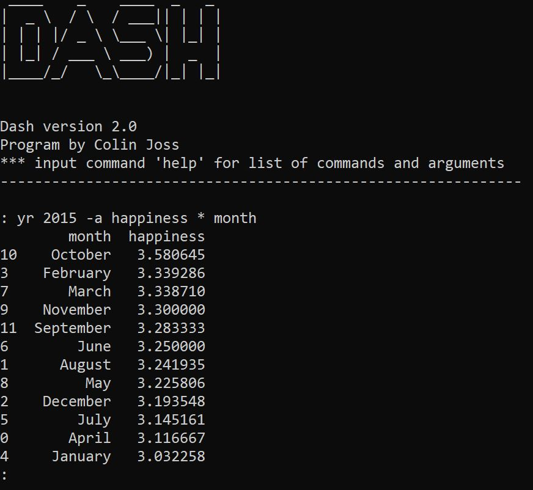

# dash

DASH is a shell-like program that facilitates the maintenance 
of my personal diary. The name is a silly portmanteau of diary and
bash. It also cleverly references how much time this saves me. I
am good at naming things!

Beginning at age 16, I've journaled my life through regular 
MP3 voice recordings and an accompanying spreadsheet of life 
data. Each recording is a diary entry, and the spreadsheet 
provides much-needed context for these entries. Information
tracked in the spreadsheet includes things like a brief
summary of each day, a list of relevant people to each day,
 and a happiness index.

I am fast approaching 10 years of data about my own life.
As a new developer, I wanted to facilitate how 
I interact with this data by constructing a shell-like 
program that allows a set of custom commands and arguments 
to access and display my data.

## Usage

COMMANDS

|  | sd | rd | yr | all |
| --- | --- | --- | --- |--- |
| action | get specific date | get random date | get specific year | get all dates |
| example | sd M/D/YYYY | rd | yr YYYY | all |

ARGUMENTS

|  | -r | -o | -w | -a | -s | -p |
| --- | --- | --- | --- |--- | --- | --- |
| action | reduce | output format | with search term | average | sum | plot |
| example | -r M/D/YYYY M/D/YYYY | -o column1+column2,... | -w search+terms+here > column | -a column (* column) | -s column (* column) | -p graphtype |

## Technologies

Project made with:
- Python v.3.9
- random, math, datetime, matplotlib
- pyfiglet library v.0.0.1 - for the title
- pandas library v.1.2.2 - for data manipulation

## Installation

Clone from Github and run in the terminal. This project was not made
with the intention of people other than me using it, but... it's here
if someone wants it. Note that you would either have to structure your
diary data csv exactly as mine or modify the source code.
