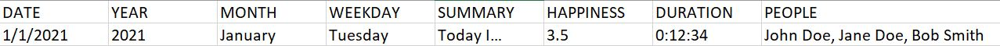

# diary-assistant

diary-assistant is a program that facilitates the maintenance of my
personal diary.

Since I was 16, I've journaled my life through MP3 voice 
recordings and an accompanying spreadsheet of life data. Each
recording is a diary entry, and the spreadsheet provides 
much-needed context to these entries.

This is how the diary spreadsheet is currently structured:

diary-assistant uses this data to calculate statistics,
perform search operations, and help me update the spreadheet.
I can also just modify the spreadsheet directly.

## Technologies

Project made with:
- Python v.3.9
- os module
- math module
- csv library
- datetime library
- calendar module
- inquirer module v.2.7.0
- mutagen module v.1.45.1
- figlet module v.0.0.1
- pandas library v.1.2.2

## Installation

Clone from Github and run in the terminal. This project was not made
with the intention of people other than me using it, but... it's here
if someone wants it.
